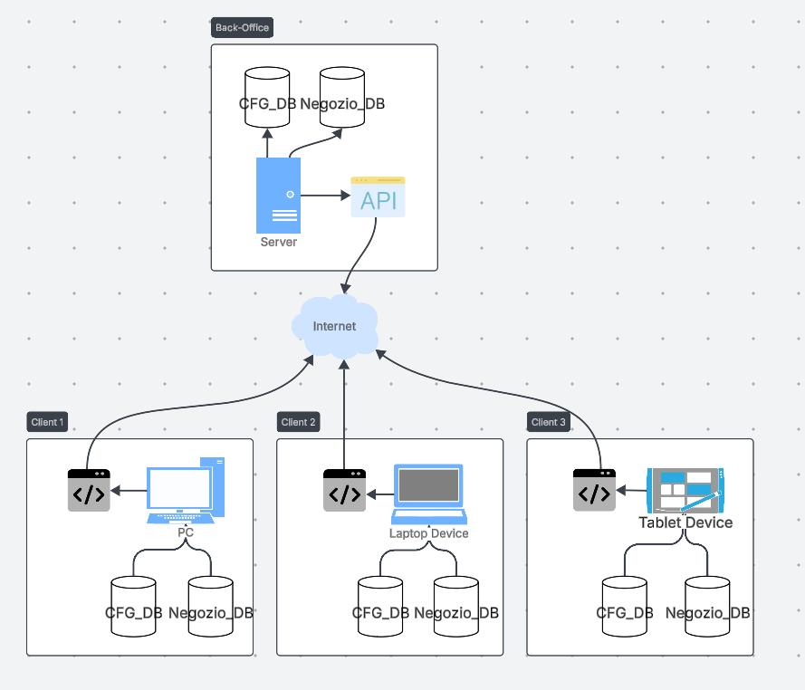

<details>
<summary><strong>DMS Sync Solution</strong></summary>

# Overview
A .NET 8 Database synchronization solution using Dotmim.Sync Framework for bidirectional data sync between SQL Server Databases.

**Framework Documentation**: [Dotmim.Sync Framework](https://dotmimsync.readthedocs.io/) - refer to the official documentation for advanced configuration options and troubleshooting.

> **Note from the Author:**  
> This solution was developed by Luca Parise as part of a university thesis project. It represents my first attempt at building a real-world application using these technologies. While every effort was made to ensure quality, there are areas that can be improved due to limited time and experience with the tools involved. Please keep this context in mind when reviewing or extending the code. Constructive feedback and contributions are welcome—good luck if you decide to build upon this work!


<details>
<summary><strong>Quick Start</strong></summary>

Get the DMS Sync Solution, or whatever name it has been given by now, running locally using visual studio. 
> **For Docker deployment**, see the [Docker Deployment section](#Docker_Deployment) below for containerized setup.


Step-by-step guide to get the solution running locally:
### Prerequisites

- **Visual Studio 2022** (Community, Professional, or Enterprise)
- **.NET 8 SDK** (included with VS 2022)
- **SQL Server 2022** (Express or full version)
- **Database files** (.bak files or existing databases)

### Step 1: Clone and Open Solution

```bash
# Clone the repository
git clone <your-repo-url>
cd DmsSyncSolution

# Open in Visual Studio
# Double-click DmsSyncSolution.sln
# OR open Visual Studio and use File > Open > Project/Solution
```
### Step 2: Prepare Databases

**Option A: Restore from .bak files (Recommended)**
1. Open SQL Server Management Studio (SSMS)
2. Connect to your SQL Server instance
3. Restore your databases:
   - `CFG_DB` (configuration database)
   - `DB` (business data database)

**Option B: Use existing databases**
- Ensure you have two databases with the required tables
- Note the database names for configuration

**Enable Change Tracking** (Critical step):
```sql
-- Run this on BOTH databases
ALTER DATABASE [DB_NAME]
SET CHANGE_TRACKING = ON (CHANGE_RETENTION = 7 DAYS, AUTO_CLEANUP = ON);
```
### Step 3: Configure Connection Strings

Both the client and server applications use a JSON configuration file (typically `appsettings.json`) to specify connection strings, tables to synchronize, and other settings.  
While configuration is minimal, it is **critical** to follow the correct logic for database assignments to ensure proper synchronization.

#### **Database Naming Convention**

To avoid ambiguity, the codebase uses a consistent naming convention for databases:

- **PrimaryDatabase / Db1**  
  Refers to the **configuration database**, usually identified by a name starting with the prefix `CFG` (e.g., `CFG_DB`).

- **SecondaryDatabase / Db2**  
  Refers to the **business (non-configuration) database**, i.e., the one **without** the `CFG` prefix.

This convention is applied throughout the implementation to clearly distinguish between the two databases and must be followed in all configuration files.


**Configure SyncServer:**
```json
{
  "SyncConfiguration": {
    "RunProvisionOnStartup": true,
    "PrimaryDatabaseConnectionString": "Server=...;Database=...;User ID=...;Password=...;Encrypt=False;TrustServerCertificate=True;MultipleActiveResultSets=True",
    "SecondaryDatabaseConnectionString": "Server=...;Database=...;User ID=...;Password=...;Encrypt=False;TrustServerCertificate=True;MultipleActiveResultSets=True",
    "SyncOptions": {
      "BatchSize": 800,
      "DbCommandTimeout": 300,
      "ConflictResolutionPolicy": "ClientWins"
    },
    "DatabaseTables": {
      "PrimaryDatabase": ["cfg_table1"," cfg_table2", "..."],
      "SecondaryDatabase":["clienti", "fornitori", "..."]
    }
  }
}
```
The content of the appsettings.json is pretty straight-forward and there is not much to say.
One critical options is the `ConflictResolutionPolicy` which i put as ClientWins as Default but it can be changed with ServerWins. For more informations about the conflict resolution policy i'll send you to the official documentation od DMS.  


**Configure SyncClient:**


------
- Building the solution
- Initial database setup
- Running the server
- Running the client

</details>

<details>
<summary><strong>Architecture</strong></summary>

- **SyncServer**: ASP .NET Core Web API providing sync endpoints
- **SyncClient**: Console application for client-side synchronization
- **Docker Support**: Container orchestration for testing environments

<p align="center">
  
</p>

</details>

<details>
<summary><strong>appsettings.json Structure for the Server Side</strong></summary>

When configuring connection strings, it is absolutely essential that both the server and client applications use identical database assignments. Both `PrimaryDatabaseConnectionString` must point to the same database (either the CFG database containing tables like `cfg_Aziende`, `cfg_Utenti` or the main database containing tables like `ana_Clienti`, `ana_Fornitori`), and both `SecondaryDatabaseConnectionString` must point to the other database. You can choose either the CFG database as primary and the main database as secondary, or vice versa, but whatever pattern you choose must be applied consistently across all server and client configurations - mixing these assignments will cause synchronization failures.

```json
{
  "SyncConfiguration": {
    "RunProvisionOnStartup": true,
    "PrimaryDatabaseConnectionString": "Server=localhost,14330;Database=ZEUSCFG_TERRADISIENA;User ID=sa;Password=Terya12345!;Encrypt=False;TrustServerCertificate=True;MultipleActiveResultSets=True",
    "SecondaryDatabaseConnectionString": "Server=localhost,14330;Database=TERRADISIENA;User ID=sa;Password=Terya12345!;Encrypt=False;TrustServerCertificate=True;MultipleActiveResultSets=True",
    "SyncOptions": {
      "BatchSize": 800,
      "DbCommandTimeout": 300,
      "ConflictResolutionPolicy": "ClientWins"
    },
    "DatabaseTables": {
      "PrimaryDatabase": [
        "[cfg_Aziende]",
        "[cfg_Utenti]",
        "[...]"
      ],
      "SecondaryDatabase": [
        "[ana_CampiLiberiFornitori]",
        "[ana_Clienti]",
        "[...]"
      ]
    }
  }
}
```
</details>

</details>


<details>
<summary><strong>Installation &amp; Setup</strong></summary>

<details>
<summary><strong>Prerequisites</strong></summary>

- .NET 8 SDK installed on the host (for local runs)
- Docker + Docker Compose (for containerized environment)
- SQL Server 2022 instances (central + clients)
- Database backups (.bak)

</details>

<details>
<summary><strong>Database Preparation</strong></summary>

1. Both the SyncServer and SyncClient rely on Dotmim.Sync’s SqlSyncChangeTrackingProvider, which requires SQL Server Change Tracking to be enabled.
  If not enabled, synchronization will fail immediately.

  Run the following command on each database to enable Change Tracking at the database level:
  ```sql
  ALTER DATABASE [Nome database]
  SET CHANGE_TRACKING = ON (CHANGE_RETENTION = 7 DAYS, AUTO_CLEANUP = ON);
  ```

  You can also enable the change tracking feature only on the specific tables you wish to synchronize. Use the following query template:
  ```sql
  ALTER TABLE dbo.cfg_Aziende ENABLE CHANGE_TRACKING WITH (TRACK_COLUMNS_UPDATED = ON);
  ALTER TABLE dbo.cfg_Utenti ENABLE CHANGE_TRACKING WITH (TRACK_COLUMNS_UPDATED = ON);
  ALTER TABLE dbo.ana_CampiLiberiFornitori ENABLE CHANGE_TRACKING WITH (TRACK_COLUMNS_UPDATED = ON);
  ALTER TABLE dbo.ana_Clienti ENABLE CHANGE_TRACKING WITH (TRACK_COLUMNS_UPDATED = ON);
  ```

2. If not already done, restore the .bak files onto the server and client SQL Server instances.  
  **Recommended**: restore the databases on all instances before running sync (faster, avoids huge initial transfers).  
  **Alternative**: restore only on the server. In this case, the SyncServer will provision and push the schema + data to the clients on the first synchronization.  
  This option can be extremely slow for large databases and may lead to timeouts.

3. Start the services.
   - Start the SyncServer first.
   - Then start one or more SyncClients.
   - You may start them simultaneously, but sequential startup is cleaner and avoids transient errors.

  After startup, verify that the server is healthy:
  ```bash
  curl http://localhost:5202/api/health
  ```
  or browse to http://localhost:5202/api/info to confirm the server is up and running. You'll see some other information about the system.

</details>

<details>
<summary><strong>Initial Synchronization</strong></summary>

The <strong>first synchronization</strong> is critical:
- If the clients have already restored the databases, then the sync will only reconcile the deltas.
- If the clients have not restored the databases, then the server has to send a full provision, which may take a long time depending on the database size.
- Both the clients and the server will make a deprovision of the DMS tables and a new provision at the start of the application, which will re-create the tables based on the setup we give. This was made to make sure that, if any change was made to the setup in the configuration, it is applied cleanly.

</details>

<details>
<summary><strong>Verification Steps</strong></summary>

<!-- Add any verification steps here if needed -->

</details>

</details>

<details>
<summary><strong>Client Configuration</strong></summary>

- appsettings.json structure for client
- Connection string requirements
- Client-specific options

</details>

<details>
<summary><strong>Server Configuration</strong></summary>

- appsettings.json structure for server
- Connection string requirements
- Server-specific options
</details>


<details>
<summary><strong>Usage Examples</strong></summary>

### Basic Synchronization

Describe how to perform a basic sync operation between server and client.

### Manual Sync Triggers

Explain how to manually trigger synchronization from the client or server.

### Monitoring Sync Status

Show how to monitor the status of ongoing or past sync operations.

### Common Workflows

Outline typical usage scenarios and recommended practices.
</details>


<details><summary><strong>Docker Deployment</strong></summary>
Since you have `docker_test` folder:

```
docker_test/
├── sync_dual_db_test/    # Primary test environment (recommended)
├── test_staging/         # Legacy - deprecated
└── test_sync/            # Legacy - deprecated
```

**Recommended Environment**: Use `sync_dual_db_test` as it contains the most up-to-date configuration and testing scenario. The others do not probably work anyway and should be deleted. I only leave them as a reference. 

<details>
<summary><strong>Running the environment</strong></summary>

Move inside the directory which contains the docker file: 
```bash
cd docker_test/sync_dual_db_test
```
Now, you can start the environment set by the docker file with the following command: 

```bash
# Start all services
docker-compose -f docker-compose.sync_dual_db_test.yml up --build
```

```bash
# Run in background (detached mode)
docker-compose -f docker-compose.sync_dual_db_test.yml up -d --build

# Start specific services only
docker-compose -f docker-compose.sync_dual_db_test.yml up central-dualdb-tds client1-dualdb-tds

# Stop all services
docker-compose -f docker-compose.sync_dual_db_test.yml down

# Stop and remove volumes (complete cleanup)
docker-compose -f docker-compose.sync_dual_db_test.yml down -v
```
</details>

<details>
<summary><strong>Service Access and Endpoints</strong></summary>

Once running, the following services are available: 

**API Endpoints:**
- **SyncServer API**: `http://localhost:5202/sync`
- **Health Check**: `http://localhost:5202/api/health`
- **System Info**: `http://localhost:5202/api/info`

**Database Connections (via SQL Server Management Studio):**
- **Central Database**: `localhost,14330` (Username: `sa`, Password: `Terya12345!`)
- **Client 1 Database**: `localhost,14331` (Username: `sa`, Password: `Terya12345!`)
- **Client 2 Database**: `localhost,14332` (Username: `sa`, Password: `Terya12345!`)  
- **Client 3 Database**: `localhost,14333` (Username: `sa`, Password: `Terya12345!`)
</details>

<details>
<summary><strong>Monitoring and debugging</strong></summary>

```bash
# View logs from all services
docker-compose -f docker-compose.sync_dual_db_test.yml logs -f

# View logs from specific services
docker-compose -f docker-compose.sync_dual_db_test.yml logs -f syncserver-dualdb-tds
docker-compose -f docker-compose.sync_dual_db_test.yml logs -f syncclient1-dualdb-tds
docker-compose -f docker-compose.sync_dual_db_test.yml logs -f init-dualdb-tds

# Check service status and health
docker-compose -f docker-compose.sync_dual_db_test.yml ps

# Follow logs with timestamps
docker-compose -f docker-compose.sync_dual_db_test.yml logs -f -t

# View last 50 lines of logs
docker-compose -f docker-compose.sync_dual_db_test.yml logs --tail 50
```
</details>

<details>
<summary><strong>Database Verification</strong></summary>

```bash
# Test database connection (central)
docker-compose -f docker-compose.sync_dual_db_test.yml exec central-dualdb-tds /opt/mssql-tools/bin/sqlcmd -S localhost -U sa -P 'Terya12345!' -Q "SELECT name FROM sys.databases"

# Check Change Tracking status
docker-compose -f docker-compose.sync_dual_db_test.yml exec central-dualdb-tds /opt/mssql-tools/bin/sqlcmd -S localhost -U sa -P 'Terya12345!' -Q "SELECT name, is_change_tracking_on FROM sys.databases"

# Verify table counts (example)
docker-compose -f docker-compose.sync_dual_db_test.yml exec central-dualdb-tds /opt/mssql-tools/bin/sqlcmd -S localhost -U sa -P 'Terya12345!' -Q "USE ZEUSCFG_TERRADISIENA; SELECT COUNT(*) as cfg_Aziende_Count FROM cfg_Aziende"
```
</details>

<details>
<summary><strong>Service Startup Sequence</strong></summary>

The services start in a specific order due to dependencies:

1. **Database Services** (`central-dualdb-tds`, `client1/2/3-dualdb-tds`) - Start first
2. **Database Initialization** (`init-dualdb-tds`) - Waits for all databases to be healthy
3. **Sync Server** (`syncserver-dualdb-tds`) - Waits for central database
4. **Sync Clients** (`syncclient1/2/3-dualdb-tds`) - Wait for both their local database and sync server
</details>

<details>
<summary><strong>Environment Variables Override</strong></summary>

**Critical**: In Docker, environment variables in the compose file **completely override** `appsettings.json` values:

**Local Development vs Docker**:
- **Local**: Uses `appsettings.json` with `localhost,14330` 
- **Docker**: Uses environment variables with service names like `central-dualdb-tds,1433`
- **DB**: hopefully soon

**Consistency Rule**: All sync services (server + clients) must use identical primary/secondary database assignments.
</details>

<details>
<summary><strong>Cleanup Operations</strong></summary>

```bash
# Stop services but keep data
docker-compose -f docker-compose.sync_dual_db_test.yml down

# Complete cleanup (removes all data)
docker-compose -f docker-compose.sync_dual_db_test.yml down -v

# Remove containers, networks, and images
docker-compose -f docker-compose.sync_dual_db_test.yml down --rmi all -v

# Clean up Docker system (removes unused images, networks, volumes)
docker system prune -a -f
```
</details>

<details>
<summary><strong>Primary Test Environment: sync_dual_db_test</strong></summary>

This environment provides a complete dual-database synchronization testing setup:

```
sync_dual_db_test/
├── init/
│   ├── 2_TERRADISIENA.bak                   # Database backup file for TERRADISIENA database
│   ├── init.sh                              # Shell script for container initialization
│   ├── restore-db-TerraDiSiena.sql          # SQL script to restore TERRADISIENA database
│   ├── restore-db-zeuscfg_TerraDiSiena.sql  # SQL script to restore ZEUSCFG_TERRADISIENA database
│   └── zeuscfg_terradisiena.bak             # Database backup file for ZEUSCFG_TERRADISIENA database
└── docker-compose.sync_dual_db_test.yml     # Docker Compose configuration file
```

**Important**: The `.bak` files are not included in the repository due to size constraints. You'll need to provide your own database backup files or use the SQL scripts to create sample databases.
</details>

<details>
<summary><strong>Docker Compose Configuration</strong></summary>

This Docker Compose configuration creates a **hub-and-spoke** synchronization architecture with one central server and three client nodes, each one maintaining their own databases instances.  

#### File overview 
```yaml
services: 
  # Database Infrastructure (4 SQL Server instances)
  central-dualdb-tds:     # Master database hub (port 14330)
  client1-dualdb-tds:     # Client 1 local database (port 14331)
  client2-dualdb-tds:     # Client 2 local database (port 14332)
  client3-dualdb-tds:     # Client 3 local database (port 14333)

  # Database Initialization
  init-dualdb-tds:        # One-time setup service (restores .bak files)

  # Synchronization Infrastructure
  syncserver-dualdb-tds:  # Central sync coordination API (port 5202)
  syncclient1-dualdb-tds: # Client 1 sync agent
  syncclient2-dualdb-tds: # Client 2 sync agent
  syncclient3-dualdb-tds: # Client 3 sync agent

# Network isolation for all sync services
networks:
  syncnet: {}

# Persistent storage for each database instance
volumes: 
  central_data_staging: {}   # Central hub data persistence
  client1_data_staging: {}   # Client 1 data persistence
  client2_data_staging: {}   # Client 2 data persistence
  client3_data_staging: {}   # Client 3 data persistence
```
**Service Count**: 9 total services (4 databases + 1 initializer + 1 server + 3 clients)  
**Network Architecture**: Hub-and-spoke with isolated `syncnet` for secure communication  
**Data Persistence**: 4 named volumes ensuring data survives container restarts  
**Port Mapping**: Each database exposed on unique host ports (14330-14333) for external access
</details>

<details>
<summary><strong>Database Services (Sql Server Instances)</strong></summary>

All database services in this Docker Compose configuration follow the same structural pattern, with only specific values differing between the central hub and client instances.

```yaml
central-dualdb-tds:
    image: mcr.microsoft.com/mssql/server:2022-latest
    container_name: central-dualdb-tds
    environment:
      - ACCEPT_EULA=Y
      - SA_PASSWORD=Terya12345!
      - MSSQL_PID=Express
    ports:
      - "14330:1433"
    volumes:
      - central_data_staging:/var/opt/mssql
      - ./init:/var/opt/mssql/backup
    networks: [syncnet]
    restart: unless-stopped
    healthcheck:
      test: ["CMD-SHELL", "bash -c '</dev/tcp/127.0.0.1/1433'"]
      interval: 5s
      timeout: 3s
      retries: 30
```
<!-- Field descriptions and table omitted for brevity, see original content for full details. -->
</details>

<details>
<summary><strong>Init-dualdb-tds service</strong></summary>

```yaml
init-dualdb-tds:
    image: mcr.microsoft.com/mssql-tools
    container_name: init-dualdb-tds
    depends_on:
      central-dualdb-tds:
        condition: service_healthy
      client1-dualdb-tds:
        condition: service_healthy
      client2-dualdb-tds:
        condition: service_healthy
      client3-dualdb-tds:
        condition: service_healthy
    environment:
      - SA_PASSWORD=Terya12345!
    volumes:
      - ./init:/init:ro
    entrypoint: ["bash","-lc","tr -d '\r' </init/init.sh >/tmp/init.sh && bash /tmp/init.sh"]
    networks: [syncnet]
    restart: "no"
```
<!-- Field descriptions and sequence omitted for brevity, see original content for full details. -->
</details>

<details>
<summary><strong>Clients and Server Services</strong></summary>

The synchronization infrastructure consists of one central coordination server and three client agents that handle bidirectional data synchronization between the central hub and individual client databases.

<details>
<summary>Server service</summary>

```yaml
  syncserver-dualdb-tds:
    build: ../../SyncServer
    image: dmssyncserver-dualdb:latest
    container_name: syncserver-dualdb-tds
    depends_on:
      central-dualdb-tds:
        condition: service_healthy
    environment:
      - PrimaryDatabaseConnectionString=Server=central-dualdb-tds,1433;Database=ZEUSCFG_TERRADISIENA;User ID=sa;Password=Terya12345!;Encrypt=True;TrustServerCertificate=True;MultipleActiveResultSets=True      
      - SecondaryDatabaseConnectionString=Server=central-dualdb-tds,1433;Database=TERRADISIENA;User ID=sa;Password=Terya12345!;Encrypt=True;TrustServerCertificate=True;MultipleActiveResultSets=True
      - ASPNETCORE_ENVIRONMENT=Development
      - ASPNETCORE_URLS=http://0.0.0.0:8080
    ports:
      - "5202:8080"
    networks: [syncnet]
    restart: unless-stopped
    healthcheck:
      test: ["CMD-SHELL", "bash -c '</dev/tcp/127.0.0.1/8080'"]
      interval: 5s
      timeout: 3s
      retries: 60
```
</details>

<details>
<summary>Client service</summary>

```yaml
  syncclient1-dualdb-tds:
    build: ../../SyncClient
    image: dmssyncclient1-dualdb:latest
    container_name: syncclient1-dualdb-tds
    depends_on:
      client1-dualdb-tds:
        condition: service_healthy
      syncserver-dualdb-tds:
        condition: service_healthy
    environment:
      - PrimaryDatabaseConnectionString=Server=client1-dualdb-tds,1433;Database=ZEUSCFG_TERRADISIENA;User ID=sa;Password=Terya12345!;Encrypt=True;TrustServerCertificate=True;MultipleActiveResultSets=True
      - SecondaryDatabaseConnectionString=Server=client1-dualdb-tds,1433;Database=TERRADISIENA;User ID=sa;Password=Terya12345!;Encrypt=True;TrustServerCertificate=True;MultipleActiveResultSets=True
      - PrimarySyncEndpoint=http://syncserver-dualdb-tds:8080/api/sync/db1
      - SecondarySyncEndpoint=http://syncserver-dualdb-tds:8080/api/sync/db2
    networks: [syncnet]
    restart: unless-stopped
```
</details>

<!-- Communication flow, technologies, and operational characteristics omitted for brevity. -->
</details>

<details>
<summary><strong>Troubleshooting Common Issues</strong></summary>

**Services won't start:**
```bash
# Check Docker Desktop is running
docker version

# Check available ports
netstat -an | findstr "14330\|14331\|14332\|14333\|5202"

# Check container status
docker-compose -f docker-compose.sync_dual_db_test.yml ps
```

**Docker becoming unresponsive:**

One critical issue encountered during testing was Docker Desktop becoming completely unresponsive, which manifested in several ways:
- Database containers became inaccessible through SQL Server Management Studio (SSMS)
- Sync clients experienced connection timeouts when attempting to reach the server
- Docker commands would hang indefinitely without response
- Container logs stopped updating despite services appearing to run

**Resolution steps for Docker unresponsiveness:**

1. **Force close all Docker processes:**
   - Open Task Manager (Ctrl+Shift+Esc)
   - End all Docker-related processes, including:
     - `Docker Desktop.exe`
     - `dockerd.exe` 
     - `docker.exe`
     - Any background Docker processes

2. **Shutdown WSL (Windows Subsystem for Linux):**
   ```bash
   wsl --shutdown
   ```
   This command forces a complete shutdown of the WSL virtual machine that Docker Desktop relies on.

3. **Restart Docker Desktop:**
   - Wait 30-60 seconds after WSL shutdown
   - Launch Docker Desktop from the Start menu
   - Wait for Docker to fully initialize before running containers   

4. **Verify Docker functionality:**
   ```bash
   # Test basic Docker functionality
   docker version
   docker ps
   
   # If successful, restart your environment
   cd docker_test/sync_dual_db_test
   docker-compose -f docker-compose.sync_dual_db_test.yml up -d --build
   ```
    **Prevention tips:**
    - Ensure sufficient system resources (minimum 8GB RAM, 4GB available for Docker)
    - Avoid running multiple heavy containerized applications simultaneously
    - Regularly clean up unused containers and images with `docker system prune`
    - Monitor Docker Desktop logs for early warning signs of resource exhaustion

5. If everything has failed uninstall and reinstall docker
</details>

</details>


<!-- ## API Reference
Document the SyncServer endpoints:
- Available endpoints
- Request/Response formats
- Authentication (if any)
- Error responses -->


<!-- ## Troubleshooting
### Common Issues
### Error Messages and Solutions
### Performance Tuning
### Logging and Diagnostics


## Development
### Project Structure
### Building from Source
### Running Tests
### Contributing Guidelines -->